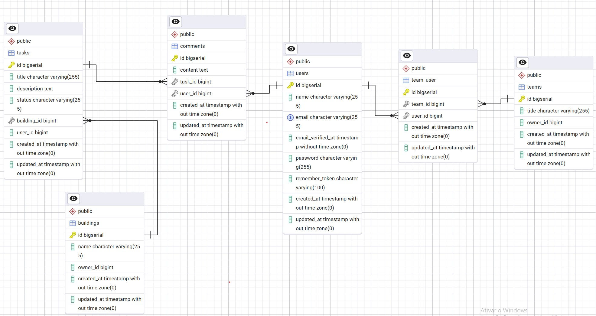

# Task system

## Index

- [Requirements](#Requeriments)
- [Setting up](#Setting-up)
- [Technical requirements](#Technical-requirements)
- [Documentation](#Documentation)
	- [Database](#Database)


## Requirements

In order to run this project you either need to have docker and docker-compose installed OR php and composer.

## Setting up

Run the following commands:

```
git clone https://github.com/settle-real-state-mngmt/task-system.git
cd task-system
make install
```

By running the above you will be cloning the repo, going into its root folder and running make install.

The command make install will:

1. Install the project dependencies
2. Create a .env file
3. Run our containers configured by our docker-composel.yml
4. Generate a project key
5. Generate a jwt secret
6. Run our migrations and seeders

In case you do not have docker installed follow [this](https://github.com/settle-real-state-mngmt/task-system/wiki/Set-up-without-docker) section on the project wiki!

## Documentation

### Database

Given the project description and the Technical requirements here is the process I've followed in order to build the database.

A client needs to manage multiple buildings.
Owners to create tasks for their teams within each building.
Each task has comments.
Tasks have 4 possible status Open, In Progres, Completed or Rejected.

Now that I have the requirements based on the description I can break them down more...

A user can create buildings.
There are two roles in the system:
1. Building Owner
2. Team member

Building owners are the ones who create the building.
Team owners are the ones who create the team.
Owners and Team members can create tasks and comments
Team members that are not part of the same team can't see each others task

We can break one layer further before building the ER itself:

A user has one or many buildings.
A user has one or many teams.
A building has one or many tasks.
A task has one or many comments.

Which ended up being the ER below.



With that I can achieve every [requirement](#Technical requirements).

## Technical requirements

- [ ] Develop an application using Laravel with REST architecture.
- [ ] Implement GET endpoint for listing tasks of a building along with their comments.
- [ ] Implement POST endpoint for creating a new task.
- [ ] Implement POST endpoint for creating a new comment for a task.
- [ ] Define the payload structure for task and comment creation, considering necessary relationships and information for possible filters.
- [ ] Implement filtering functionality, considering at least three filters such as date range of creation and assigned user, or task status and the building it belongs to.
- [ ] Containerize the application using Docker. 
- [ ] Type methods and parameters for improved code clarity. 
- [ ] Include descriptive PHPDoc in the methods.
