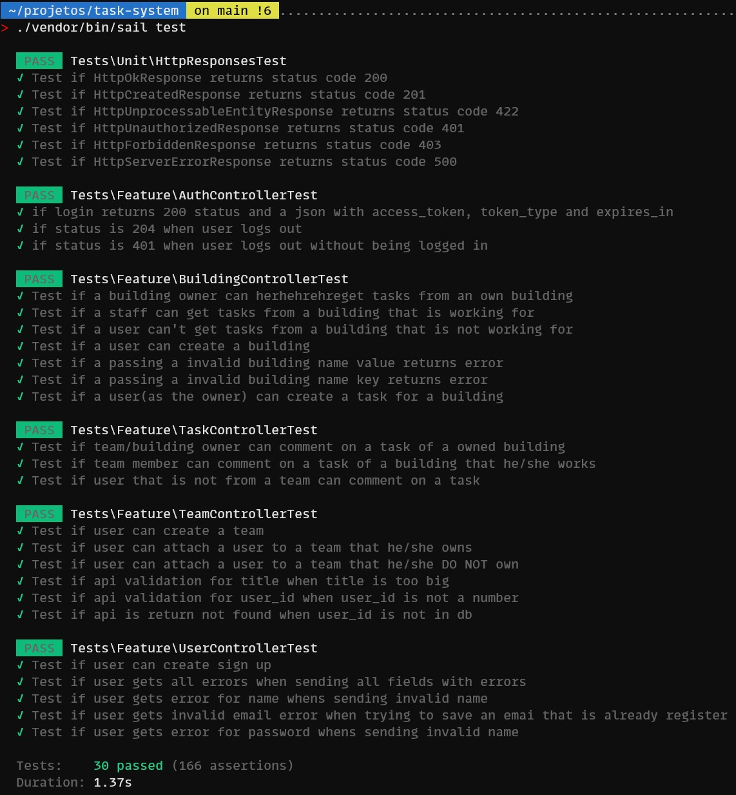

# Task system

## Index

- [Requirements](#Requeriments)
- [Setting up](#Setting-up)
- [Technical requirements](#Technical-requirements)
- [Documentation](#Documentation)
	- [Endpoints](#Endpoints)
        - [Flow of use of the API](#Flow-of-use-of-the-API)
	- [Telescope](#Telescope)
	- [Database](#Database)
        - [Process](#Process)
- [What Could be better?](#What-could-be-better)

## Requirements


In order to run this project you either need to have docker and docker-compose installed OR php and composer.

For method 1

- Docker
- docker-compose
- make
- git

For the second way of install you would additionaly need

- composer
- php


## Setting up

Run the following commands:

```
git clone https://github.com/settle-real-state-mngmt/task-system.git
cd task-system
make install
```

By running the above you will be cloning the repo, going into its root folder and running make install.

The command make install will:

1. Install the project dependencies
2. Create a .env file
3. Run our containers configured by our docker-composel.yml
4. Generate a project key
5. Generate a jwt secret
6. Run our migrations and seeders

A second way of installing the application is by running the following commands:

```
git clone https://github.com/settle-real-state-mngmt/task-system.git
cd task-system
cp .env.example .env
docker-compose up -d
```

After the container is up you can run

```
composer install
```

## Tests

```
./vendor/bin/sail test
```




## Documentation


## Endpoints

This api ships with a swagger documentation! you can access it on http://localhost/docs/api endpoing.

### Flow of use of the API

This API has most of its endpoints protected via JWT authentication. The only routes that are **NOT** protected are:

- POST /users
- POST /login

The first one because it is used to register a user in the application and the second one so we can get authenticated.

After creating a user and login in you have a JWT Token and with that you can access the following routes:

> Don't forget to add the header to your request
> Authorization Bearer $token

1. POST /logout
2. POST /teams
3. POST /teams/{team}/users
4. GET /buildings/{id}/tasks
5. POST /buildings
6. POST /buildings/{building}/tasks
7. PUT  /buildings/{building}/tasks/{task}

1. Logs out
2. Creates a team

The user whom creates a team is assigned as its owner and this information is later used to check access control.

> to register a Team you need a body with a key Title.

3. Add a user to a team

Only the Owner of a team can add another user to it.

> to add a user to a team you need a body with a key user_id


4. Get all tasks from a given building

In this endpoint you also have the following query params to filter the tasks.

assignee for a specific user (user_id)
end/start for date range
status for well.. status (Open, In progress, Completed, Rejected)

Team/Building owners and members can check building tasks.
Users that are not part of a team can't see tasks for buildings.

5. Creates a building

> to add a building you need a body with a key name

6. Creates a task to a building

Team/Building owners and members can add a task to a building.

7. Updates a task

Team/Building owners and members can add a task to a building.

## Telescope

Telescope was installed if you would like to have any insights about the project. You can access via  http://localhost/telescope.

### Database

pgAdmin 4 was added to the docker image if you would like to check anything with the database. You can access on  http://localhost:5050/.

> admin@admin.com and password for the default credentials.

> Ah don't forget to use docker's alias in there add a server.

#### Process

Given the project description and the Technical requirements here is the process I've followed in order to build the database.

A client needs to manage multiple buildings.
Owners to create tasks for their teams within each building.
Each task has comments.
Tasks have 4 possible status Open, In Progres, Completed or Rejected.

Now that I have the requirements based on the description I can break them down more...

A user can create buildings.
There are two roles in the system:
1. Building Owner
2. Team member

Building owners are the ones who create the building.
Team owners are the ones who create the team.
Owners and Team members can create tasks and comments
Team members that are not part of the same team can't see each others task

We can break one layer further before building the ER itself:

A user has one or many buildings.
A user has one or many teams.
A building has one or many tasks.
A task has one or many comments.

Which ended up being the ER below.


With that I can achieve every [requirement](#Technical requirements).

## Technical requirements

- [x] Develop an application using Laravel with REST architecture.
- [x] Implement GET endpoint for listing tasks of a building along with their comments.
- [x] Implement POST endpoint for creating a new task.
- [x] Implement POST endpoint for creating a new comment for a task.
- [x] Define the payload structure for task and comment creation, considering necessary relationships and information for possible filters.
- [x] Implement filtering functionality, considering at least three filters such as date range of creation and assigned user, or task status and the building it belongs to.
- [x] Containerize the application using Docker. 
- [x] Type methods and parameters for improved code clarity. 
- [x] Include descriptive PHPDoc in the methods.

## What could be better?

I think the database structure could be a little different specially because the access controlls I did got a little difficult to do.

Also I wish I had done something better towards the filter I have the feeling that query scopes would be a good fit for them but I figure them out to late.

My commits... some sometimes they got too big with like 12 files, though to be fair, creating a feature with laravel sometimes require multiple classes. Anyhow I think some sort of trunk base development would be better.
